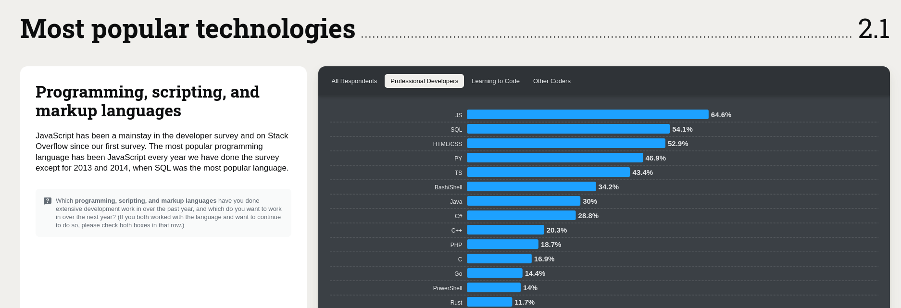

# Day 12

## Code

## Most popular technologies

As we can see, the `js` is most popular.



source of this [image](https://survey.stackoverflow.co/2024/technology#most-popular-technologies-language-prof).

## ECMAScript

ECMAScript (often abbreviated as ES) is a specification for scripting languages, including JavaScript. It defines the syntax, semantics, and core features of the language. JavaScript is an implementation of the ECMAScript specification.

### Key Points About ECMAScript:

- **Standardization:** ECMAScript is standardized by ECMA International. The standardization process helps ensure consistency across different JavaScript engines and environments.

- **Versions:** The ECMAScript standard evolves over time with new versions. Each version of ECMAScript introduces new features and improvements. For example, ES5 (ECMAScript 5) was released in 2009, and ES6 (ECMAScript 2015) brought significant updates like classes and modules.

- **Feature Evolution:** New features and syntax enhancements are proposed, reviewed, and standardized through the ECMAScript specification. These features eventually make their way into JavaScript engines and, therefore, into browsers and other JavaScript environments.

[Visit the official Link](https://ecma-international.org/publications-and-standards/standards/ecma-262/)

## Data Type

A data type is a classification that specifies which type of value a variable can hold and what operations can be performed on that value. In programming, data types define the nature of the data and ensure that operations are performed correctly.

In `JavaScript`, data types are categorized into two main groups: `primitive` and `non-primitive` (also known as `reference`) data types. Understanding these helps in handling and manipulating data effectively.

JavaScript has 8 DataTypes:

1. `String` (primitive data types)
2. `Number` (primitive data types)
3. `Bigint` (primitive data types)
4. `Boolean` (primitive data types)
5. `Undefined` (primitive data types)
6. `Null` (primitive data types)
7. `Symbol` (primitive data types)
8. `Object` (non-primitive data types)

## Primitive Data Types

Primitive data types are the basic building blocks in JavaScript. They are immutable and are not objects.

> While you cannot modify the value of a primitive directly, you can reassign a new value to a variable that holds a primitive.

```js
let x = 5; // x holds the value 5
x = 10; // Now x holds a new value 10
```

In this case, `x` initially holds the value `5`, but after reassignment, `x` holds the value `10`. This does not change the original value but rather changes what `x` points to.

There are seven primitive data types:

### 1. Number

Represents both integer and floating-point numbers.

```js
let num = 42;
let pi = 3.14;
```

### 2. String

Represents a sequence of characters enclosed in quotes (single `''`, double`""`, or backticks ` `` `).

```js
let name = "John";
let greeting = "Hello, world!";
let templateString = `Hello, ${name}`;
```

### 3. Boolean

Represents a logical value, either true or false.

```js
let isTrue = true;
let isFalse = false;
```

### 4. Undefined

Represents a variable that has been declared but not yet assigned a value.

```js
let notDefined;All these data types are built upon the fundamental object type, but they come with additional functionality and specific use cases.
console.log(notDefined); // undefined
```

### 5. Null

Represents a deliberate non-value or a "null" value, indicating the absence of any object value.

```js
let emptyValue = null;
```

### 6. Symbol

A Symbol is a primitive data type introduced in `ECMAScript 6 (ES6)`. It represents a unique and immutable value that is often used as a unique identifier for object properties.

```js
let sym = Symbol("description");
```

### 7. BigInt

BigInt is a primitive data type introduced in `ECMAScript 2020 (ES11)` that allows you to work with integers of arbitrary precision. Unlike the standard Number type which can only safely represent integers up to `2^53 - 1`, BigInt can handle much larger integers.

```js
let bigIntNumber = 1234567890123456789012345678901234567890n;
```

## Non-Primitive (Reference) Data Types

Non-primitive data types are objects and can store collections of values or more complex entities. They are mutable and are accessed by reference.

### 1. Object

A collection of key-value pairs. Objects can be created using either the object literal notation or the new Object() syntax.

```js
let person = {
  name: "Alice",
  age: 30,
  greet: function () {
    console.log("Hello!");
  },
};
```

### 2. Array (a special type of object)

A special type of object used to store ordered collections of values. Arrays are created using square brackets.

```js
let numbers = [1, 2, 3, 4, 5];
```

### 3. Function (a special type of object)

A special type of object used to define reusable blocks of code. Functions are created using the function declaration or expression syntax.

```js
function add(a, b) {
  return a + b;
}
```

> While `Arrays` and `Functions` are categorized as non-primitive data types in JavaScript, they are more specifically types of objects.

The non-primitive (or reference) data types in JavaScript are:

- Objects
- Arrays (a specialized object for lists)
- Functions (a specialized object for executable code)
- Dates (objects for handling dates and times)
- Regular Expressions (objects for pattern matching)

All these data types are built upon the fundamental object type, but they come with additional functionality and specific use cases.
