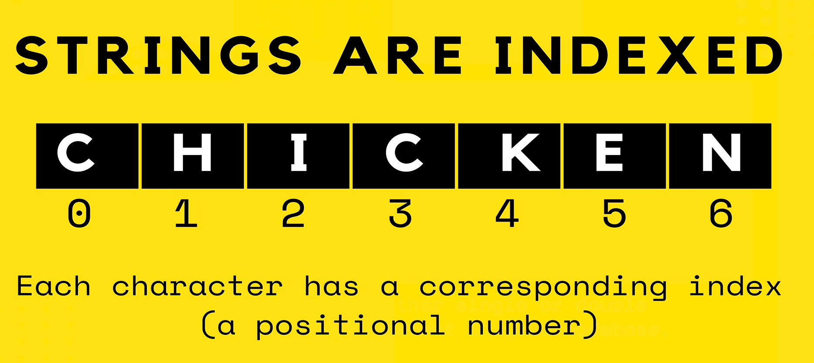

# Day 13

## Code

- [Javascript](./main.js)

## Index

In programming, an `index` is a numerical position or reference used to access individual elements within a data structure, such as arrays, or strings.

## function

A `function` in programming is a reusable block of code designed to perform a specific task. It can take `inputs (arguments)`, execute a sequence of statements, and optionally return a result.

## methods

In JavaScript, `methods` are `functions` that are associated with `objects`. They can be used to perform operations on the data contained within the object or to execute certain behaviors related to the object. Methods can be found on built-in objects like `arrays` and `strings`, or you can define your own methods in custom objects or classes.

### 1. Built-In Methods

Predefined methods provided by JavaScript's standard objects.

### 2. User-Defined Methods

Methods created by developers within objects or classes.

### 1. Zero-Based Indexing

Most programming languages (including JavaScript, Python, C, and C++) use `zero-based indexing`, where the first element of the array or list is accessed with `index 0`, the second element with `index 1`, and so forth.

<center>


</center>

### 2. One-Based Indexing

Some languages, like MATLAB and Lua, use one-based indexing, where the first element is accessed with `index 1`.

## Strings in `JS`

Strings in JavaScript are a fundamental data type used to represent text.

### 1. Creating Strings

Strings can be created using single quotes (`''`), double quotes (`""`), or backticks (` `` `) for template literals.

```js
let singleQuoteString = "Hello, world!";
let doubleQuoteString = "Hello, world!";
let templateLiteralString = `Hello, world!`;
```

### 2. Strings are indexed in JS

In JavaScript, strings are indexed, meaning each character in a string has a numerical index associated with it. This index is `zero-based`, so the first character of the string is at `index 0`, the second character is at `index 1`, and so on.



```js
let str = "Hello";
console.log(str[0]); // Output: "H"
console.log(str.charAt(1)); // Output: "e"
```

### Length of String

we can find the length of a string using the `length` property, which gives the number of characters in the string.

```js
let str = "hello";
console.log(str.length); // Output: 5
```

### String Concatenation

Combine strings using the `+` operator or the `concat` method.

```js
let greeting = "Hello";
let name = "World";
let message = greeting + ", " + name + "!";
console.log(message); // Output: "Hello, World!"

let message2 = greeting.concat(", ", name, "!");
console.log(message2); // Output: "Hello, World!"
```

### String Methods

JavaScript strings come with many `built-in` methods for string manipulation.

#### 1. `toUpperCase()`

Convert the string to uppercase.

```js
console.log("hello".toUpperCase()); // Output: "HELLO"
```

#### 2. `toLowerCase()`

Convert the string to lowercase.

```js
console.log("WORLD".toLowerCase()); // Output: "world"
```

#### 3. `trim()`

Remove whitespace from both ends of the string

```js
console.log("  trim me  ".trim()); // Output: "trim me"
```

#### 4. `slice(start, end)`

Extract a portion of the string

```js
console.log("Hello, World!".slice(7, 12)); // Output: "World"
```

#### 5. `replace(searchValue, newValue)`

Replace occurrences of a substring.

```js
console.log("Hello, World!".replace("World", "JavaScript")); // Output: "Hello, JavaScript!"
```

#### 6. `split(separator)`

Split the string into an array of substrings.

```js
console.log("a,b,c".split(",")); // Output: ["a", "b", "c"]
```

### Template Literals

Allow for embedded expressions and multi-line strings.

```js
let name = "World";
let message = `Hello, ${name}!`; // String interpolation
console.log(message); // Output: "Hello, World!"

let multiLineStr = `This is a string
that spans multiple lines.`;
console.log(multiLineStr);
```

### Immutability

Strings in JavaScript are immutable, meaning that once a string is created, it cannot be changed. Any operation that modifies a string will actually create a new string.

## Special Characters (Escape Sequences)

You can use `escape sequences` to include special characters in strings

```js
let quote = 'She said, "Hello!"';
let newLine = "First line\nSecond line";
console.log(quote); // Output: She said, "Hello!"
console.log(newLine); // Output: First line
//         Second line
```
